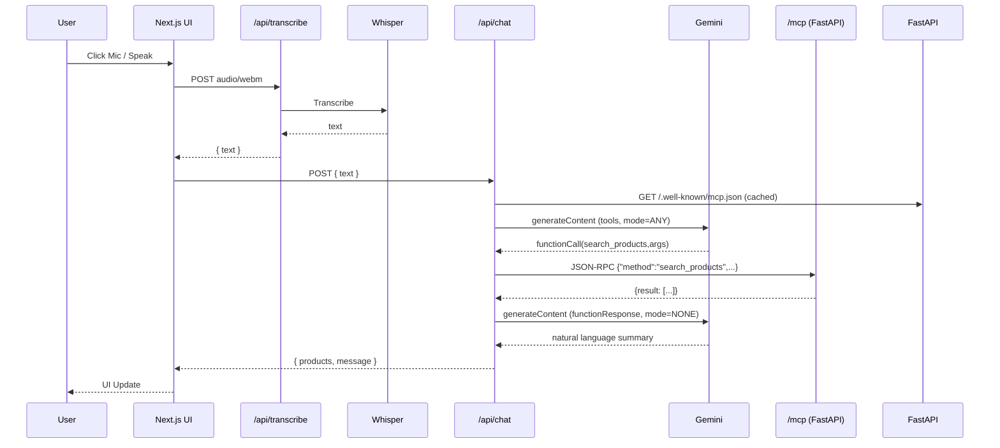

# MCP Voice App

An end‑to‑end **voice + natural language product search** application demonstrating:

* **Next.js (React + TypeScript)** as an *MCP Host*.
* **FastAPI (Python)** as an *MCP Tool Server* exposing structured product functions.
* **Google Gemini (@google/genai)** for *semantic interpretation + automatic function calling*.
* **OpenAI Whisper** for *speech‑to‑text transcription*.
* **JSON‑RPC 2.0 over HTTP** for tool invocation via `/mcp`.
* **Docker Compose** for local multi‑service orchestration.

> The project showcases how the **Model Context Protocol (MCP)** can unify multiple front‑ends (hosts) and a shared tool server, while layering voice input and LLM function calling to operate on a simple product catalog.

---

## Table of Contents

1. [Conceptual Overview](#conceptual-overview)  
2. [Architecture](#architecture)  
3. [Execution Flow](#execution-flow)  
4. [MCP Integration Details](#mcp-integration-details)  
5. [Gemini Function Calling Flow](#gemini-function-calling-flow)  
6. [Whisper Speech Transcription](#whisper-speech-transcription)  
7. [Repository Structure](#repository-structure)  
8. [Environment Variables](#environment-variables)  
9. [Local Development](#local-development)  
10. [Docker & Deployment](#docker--deployment)  
11. [Extending the Catalog / Tools](#extending-the-catalog--tools)  
12. [Security & Hardening](#security--hardening)  
13. [Troubleshooting](#troubleshooting)  
14. [Roadmap / Future Enhancements](#roadmap--future-enhancements)  
15. [Contributing](#contributing)  
16. [License](#license)

---

## Conceptual Overview

| Layer | Role | Technologies | Key Responsibility |
|-------|------|--------------|--------------------|
| **Host (UI)** | Accept user text / voice, orchestrate model calls | Next.js, TypeScript, @google/genai | Convert user intent into LLM prompts; negotiate automatic function calls; display results |
| **LLM** | Natural language understanding + tool selection | Gemini 2.0 Flash (via `@google/genai`) | Parse queries, decide which MCP tool to call, integrate tool responses |
| **Tool Server** | Domain functions (data plane) | FastAPI + MCP JSON-RPC | Provide deterministic functions (`list_products`, `search_products`) |
| **Speech Layer** | Voice → Text | OpenAI Whisper | Transcribe audio before sending to Gemini |
| **Discovery** | Tool metadata | `/.well-known/mcp.json` | Advertise tool schemas to hosts for dynamic functionDeclarations |

---

## Architecture

**High-Level (Deployed):**

```
Browser (React UI)
   │
   ├─ POST /api/transcribe ─> Next.js (Node) ─ Whisper ─> transcript text
   │
   └─ POST /api/chat ─> Next.js Host
           1. Fetch & cache /.well-known/mcp.json (FastAPI)
           2. Build functionDeclarations array
           3. Gemini generateContent (mode=ANY)
           4. If functionCall → POST /mcp (JSON-RPC)
           5. Receive tool result → second generateContent (mode=NONE)
           6. Return { message, products }
FastAPI Tool Server
   ├─ /products
   ├─ /products/search
   ├─ /mcp (JSON-RPC 2.0 facade)
   ├─ /.well-known/mcp.json (discovery)
   └─ /healthz
```

**Sequence (Voice Search Example):**



---

## Execution Flow

1. **User Input (Text or Voice)**:  
   - Voice: recorded in the browser → `/api/transcribe` → Whisper → text.
   - Text: directly sent to `/api/chat`.

2. **Tool Discovery**:  
   `/api/chat` fetches `/.well-known/mcp.json` from the FastAPI server (cached in-memory) and converts each tool into a Gemini `functionDeclarations` entry.

3. **First Gemini Call (Mode=ANY)**:  
   Gemini may:  
   * return a direct response **OR**  
   * emit a `functionCall`.

4. **Tool Invocation (JSON-RPC)**:  
   The chosen function is invoked via POST `/mcp` with JSON-RPC 2.0 payload.

5. **Second Gemini Call (Mode=NONE)**:  
   The tool response is wrapped into a `functionResponse` and passed back so Gemini can compose a natural language explanation.

6. **Response Aggregation**:  
   UI receives `{products?, message}` and renders product cards.

---

## MCP Integration Details

| Component | Responsibility |
|----------|----------------|
| `/.well-known/mcp.json` | Discovery metadata (name, version, tool list + JSON schemas) |
| `/mcp` | JSON-RPC façade mapping `method` → Python function |
| Next.js `mcpHost.ts` | Fetches + caches discovery; converts to `ToolUnion[]`; validates arguments |
| Gemini Config | `tools: [...]`, `functionCallingConfig.mode = ANY|NONE` |
| Logs | Structured JSON for latency, tool name, product counts |

**Why this matches MCP:**  
MCP’s goal is to standardize how *hosts* (LLM runtimes or orchestrators) discover and call *tools* (domain functions). Even though we are not yet using an official MCP SDK client here, we follow the *essence*:

* Discovery endpoint returning machine-readable tool schemas.  
* Explicit function invocation layer (JSON-RPC).  
* Decoupled host → multiple potential hosts can now reuse the same tool server.

To add another host (e.g. CLI agent, another web app, or a separate orchestrator), simply replicate the discovery + JSON-RPC steps.

---

## Gemini Function Calling Flow

| Phase | Input Provided | Mode | Output Expected |
|-------|----------------|------|-----------------|
| 1st call | Raw user text + functionDeclarations | `ANY` | Optionally `functionCalls[]` |
| Tool call | JSON-RPC result | n/a | Raw data object / list |
| 2nd call | Conversation History + `functionResponse` part | `NONE` | Final natural language message |

We deliberately switch to `NONE` in the second call to prevent *infinite* tool recursion and to reduce latency.

---

## Whisper Speech Transcription

| Step | Detail |
|------|--------|
| Client Recording | Browser `MediaRecorder` → `Blob (audio/webm)` |
| Upload | Multipart POST `/api/transcribe` |
| Backend (Next.js) | Uses `openai.audio.transcriptions.create` (`model=whisper-1`) |
| Response | Plain `{ text }` returned to UI |
| Error Handling | File size/type validation + informative error JSON |

---

## Repository Structure

```
root/
├─ frontend/                 # Next.js app
│  ├─ src/
│  │  ├─ app/api/chat/route.ts          # Gemini host endpoint
│  │  ├─ app/api/transcribe/route.ts    # Whisper transcription
│  │  ├─ app/page.tsx                   # Product UI
│  │  ├─ lib/mcpHost.ts                 # MCP discovery + invocation helper
│  │  └─ components/...                 # UI components
│  └─ Dockerfile
├─ backend/
│  ├─ main.py                # FastAPI server (products + MCP + discovery)
│  ├─ data/products.json
│  ├─ prompts.yml            # discovery + whisper config
│  ├─ pyproject.toml
│  └─ Dockerfile
├─ docker-compose.yml
├─ README.md
└─ SETUP.md                  # Step-by-step setup (see there)
```

---

## Environment Variables

| Variable | Required At | Purpose |
|----------|-------------|---------|
| `GEMINI_API_KEY` | Next.js server | Gemini model access |
| `OPENAI_API_KEY` | Next.js server | Whisper transcription |
| `BACKEND_INTERNAL_URL` | Next.js server | Base URL for FastAPI (e.g. `https://mcp-api.example.com`) |

> **Do NOT** expose secrets with `NEXT_PUBLIC_` prefix.  

---

## Local Development

### Prerequisites
* Node.js ≥ 20  
* Python ≥ 3.12 (project targets 3.13 in Docker)  
* Docker + Docker Compose (optional but recommended)  

### Run with Docker

```bash
docker compose up --build
# Frontend: http://localhost:3000
# Backend:  http://localhost:8000
```

### Run Without Docker

_Backend:_
```bash
cd backend
poetry install
uvicorn main:app --reload --port 8000
```

_Frontend:_
```bash
cd frontend
npm install
npm run dev
```

Ensure `BACKEND_INTERNAL_URL=http://localhost:8000` in frontend environment.

---

## Docker & Deployment

| Layer | Deployment Notes |
|-------|------------------|
| Frontend (Next.js) | Build → Static + serverless functions (`/api/chat`, `/api/transcribe`) |
| Backend (FastAPI) | Containerized; can run on Vercel (limited), Fly.io, Railway, Render, AWS Fargate |
| Separation | Multiple hosts can point to the same FastAPI tool server |

### Production Checklist
- Rotate API keys regularly.
- Enable HTTPS (Vercel handles certs).
- Add request logging (already JSON).
- Set CORS origins to actual domains (not `*`).

---

## Extending the Catalog / Tools

1. Add new Python function (e.g. `get_product_by_id`).
2. Include it in `/mcp` mapping.
3. Append schema entry in `prompts.yml` under `mcp_discovery.tools`.
4. UI automatically discovers it (after cache invalidation restart) and Gemini may start calling it if prompted.

**Tip:** Provide *clear, discriminative* descriptions so Gemini selects correct tools.

---

## Security & Hardening

| Concern | Mitigation |
|---------|------------|
| Secret leakage | Server-only env vars; never expose keys client-side |
| Prompt injection via tool data | Validate / sanitize product inputs |
| Unbounded audio size | Enforced max upload size check (extend if needed) |
| DoS via large filters | Add server-side pagination & rate limiting |
| Tool misuse | Consider whitelisting `allowedFunctionNames` |

---

## Troubleshooting

| Symptom | Likely Cause | Fix |
|---------|--------------|-----|
| `OPENAI_API_KEY not configured` | Missing env in Next.js runtime | Set in deployment & redeploy |
| `ContentUnion is required` | Incorrect `sendMessage` param shape (older code) | Use `models.generateContent` with proper `contents` |
| No `functionCalls` | Model didn’t believe a tool is needed | Improve user prompt or tool descriptions |
| Case-sensitive city filter | (Fixed) Ensure backend lowercases comparisons | Confirm deployed backend version |
| CORS errors | Origin not whitelisted | Update `allow_origins` in FastAPI |

---

## Roadmap / Future Enhancements

| Area | Idea |
|------|------|
| Retrieval | Add vector search (e.g. Qdrant) for semantic product lookup |
| Auth | Introduce JWT session to control tool access |
| Caching | ETag / conditional requests for product list |
| Observability | Add OpenTelemetry traces for each function call |
| Streaming | Use `generateContentStream` for progressive UI updates |
| Voice Output | Add TTS (Gemini or external) for spoken responses |
| Multi-Host | Add CLI or Slack bot that reuses `/mcp` |
| MLOps | Replace JSON with DB + embedding pipeline, nightly refresh job |

---

## Contributing

1. Fork repo
2. Create feature branch: `git checkout -b feature/name`
3. Add tool function + schema
4. Run tests / lint:
   ```bash
   poetry run pytest
   npm run lint
   ```
5. Submit PR with description & sample query.

---

## License

MIT

---

**Questions / Improvements?** Open an issue or start a discussion.  
Happy hacking with MCP, Whisper & Gemini! 🚀