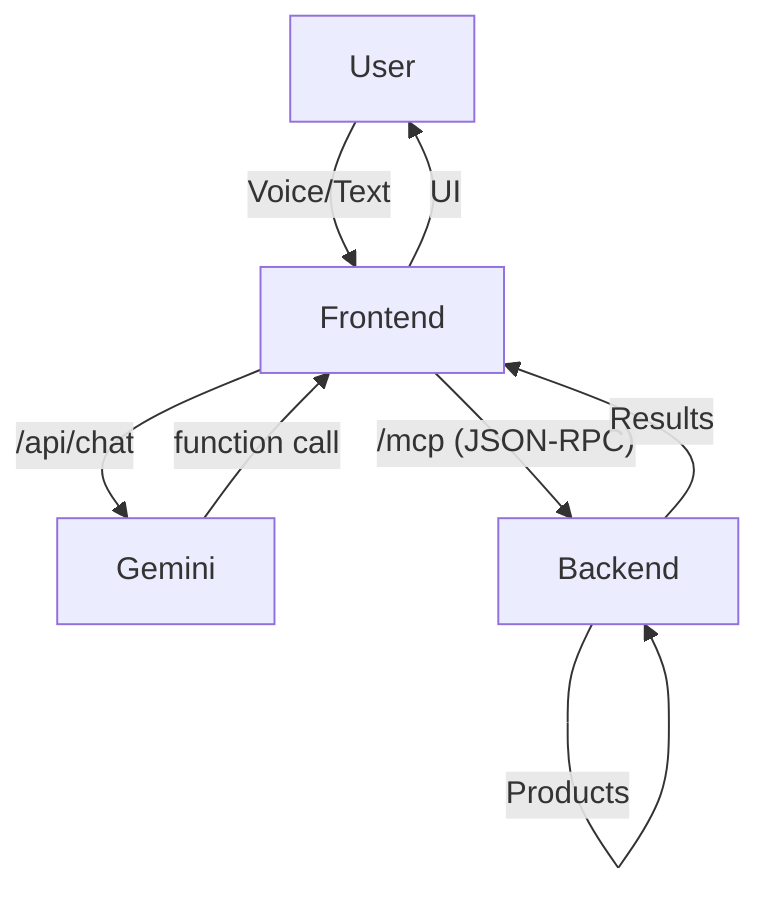

# Setup and Configuration

This document provides instructions for setting up and running the application.

## Prerequisites

- Node.js (v20 or later)
- pnpm
- Python (v3.11 or later)
- Poetry

## Installation

1.  **Frontend:**
    ```bash
    cd frontend
    pnpm install
    ```

2.  **Backend:**
    ```bash
    cd backend
    poetry install
    ```

## Environment Variables

Create a `.env` file in the root of the project and add the following:

```
GEMINI_API_KEY=your_gemini_api_key
```

You may also set `NEXT_PUBLIC_API_URL` in your frontend `.env` if your backend is not running on the default `http://localhost:8000`.

## Running the Application

1.  **Backend (FastAPI with MCP):**
    ```bash
    cd backend
    poetry run uvicorn main:app --reload
    ```
    - The backend exposes standard REST endpoints and an MCP endpoint at `/mcp` for function calling via JSON-RPC 2.0.
    - The MCP discovery file is available at `/.well-known/mcp.json`.

2.  **Frontend (Next.js):**
    ```bash
    cd frontend
    pnpm dev
    ```
    - The frontend communicates with the backend using the MCP protocol for Gemini function calling.

The application will be available at [http://localhost:3000](http://localhost:3000).

## MCP Protocol

- The backend implements the [Model-Context-Protocol (MCP)](https://github.com/google/model-context-protocol) for function calling.
- Gemini function calls are routed to the backend `/mcp` endpoint using JSON-RPC 2.0.
- The available backend functions and their schemas are described at `/.well-known/mcp.json`.

## API Endpoints

### Backend

- `GET /products` — List all products.
- `POST /products/search` — Search and filter products.
- `POST /mcp` — **MCP endpoint:** Accepts JSON-RPC 2.0 requests for `list_products` and `search_products`.
- `GET /.well-known/mcp.json` — MCP discovery endpoint.

### Frontend

- `POST /api/chat` — Accepts user queries, interacts with Gemini, and returns product results.

## Architecture Diagram



## Notes

- Ensure `data/products.json` exists in the backend directory for product data.
- The MCP protocol enables easy extension of backend functions for Gemini and other LLMs.